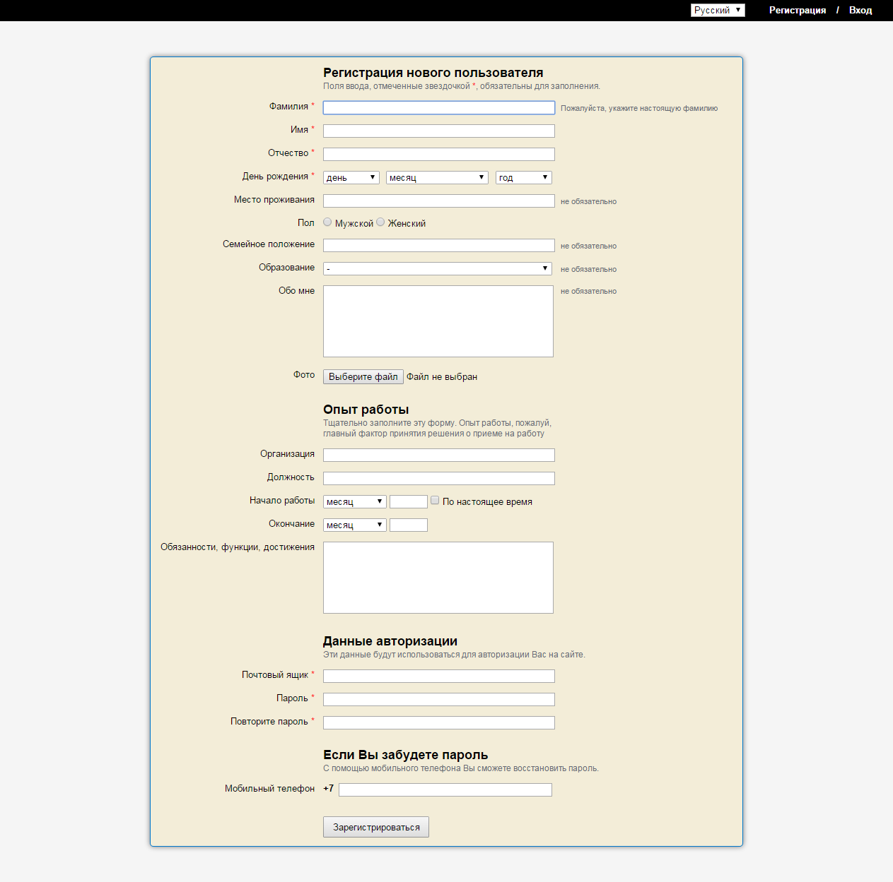
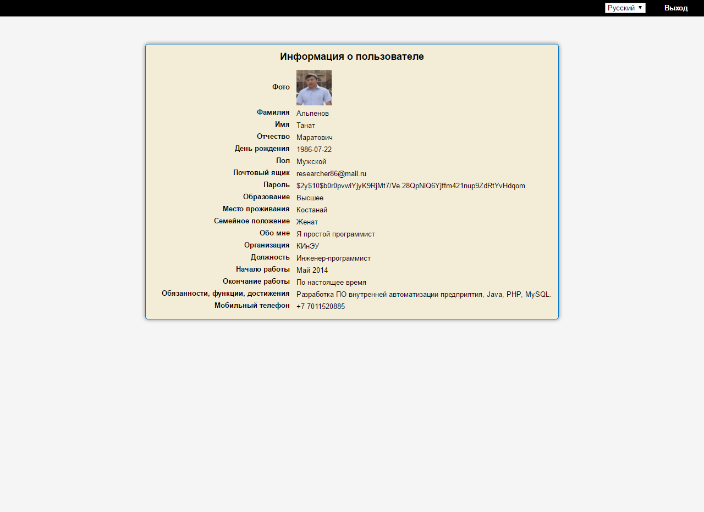
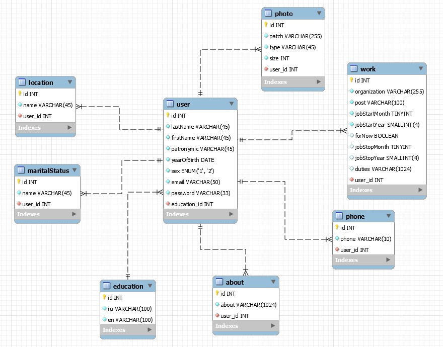

# php_mvc
Движок сайта реализован с применением паттерна MVC. Были реализованы такие возможности как: смена языков (переводы лежат в БД), проверка корректности, валидности ввода данных. 

### Технологии: 
- PHP (PSR-1, PSR-2, PSR-4, PHPUnit)
- JavaScript (Core) 
- CSS
- HTML
- MySQL

